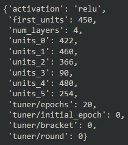

# Analysis Overview
This analysis is meant to determine which neural network models would be best used to determine if applicants for grants that are most likely to succeed. 

- Application Type
- Affiliation
- Classification
- Use Case
- Organization
- Status
- Income Amount
- Special Considerations
- Ask Amount

## Results
### Data pre-processing
Target:
- Was the charity able to complete their goal with the funding?

Features:
- Application Type
    - Binned items with a value count under 250 into an "Other" category
- Affiliation
- Classification
    - Binned items with a value count under 300 into an "Other" category
- Use Case
- Organization
- Status
- Income Amount
- Special Considerations
- Ask Amount

Variables that were removed:
- Name
- EIN
### Trained Models

Network 1:
- Layers: 3
- Nodes per layer:
    1. 7
    2. 5
    3. 3
- Loss: 3913.05
- Accuracy: 0.53236
- Summary: This is the base model and fell well short of the target 75% accuracy

Network 2:
- Layers: 3
- Nodes per layer:
    1. 9
    2. 7
    3. 5
- Loss: 25172.61
- Accuracy: 0.46764
- Summary: Despite increasing the density of each layer, this model had a worse accuracy compared to Network 1.

Network 3:
- Layers:
- Nodes per layer:
- Loss:
- Accuracy:
- Summary:

Network 4:
- Layers:
- Nodes per layer:
- Loss:
- Accuracy:
- Summary:

Network 5:
- Layers:
- Nodes per layer:
- Loss:
- Accuracy:
- Summary:

Keras-Tuner Results:
- 
- Loss: 0.55444
- Accuracy: 0.732244
- Summary: As expected, the Keras-Tuner provided the best model. However, even with the Keras-Tuner, the model still did not meet the 75% target. This is likely because either the Keras-Tuner needed increased neurons per layer or because the data coming into the model needed to be processed further.

Network 7:
- Pre-processing changes:
    - Removed:
    - Binned:
- Layers:
- Nodes per layer:
- Loss:
- Accuracy:
- Summary:

Network 8:
- Pre-processing changes:
    - Removed:
- Layers:
- Nodes per layer:
- Loss:
- Accuracy:
- Summary:

## Summary
